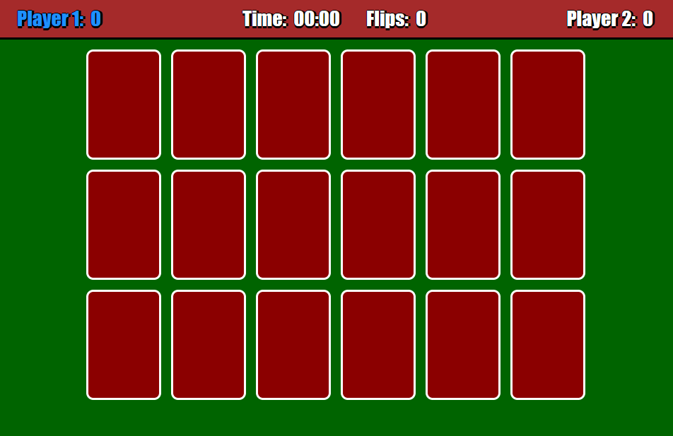

# Memory Card Game

A school assignment in webprogramming.

Play against a friend and try to find matching pair of cards.

On each turn the active player flips two cards:
- if the cards match, the player get a point and another try.
- if the cards don't match, the turn is over.

Note: Active player's is blue.
